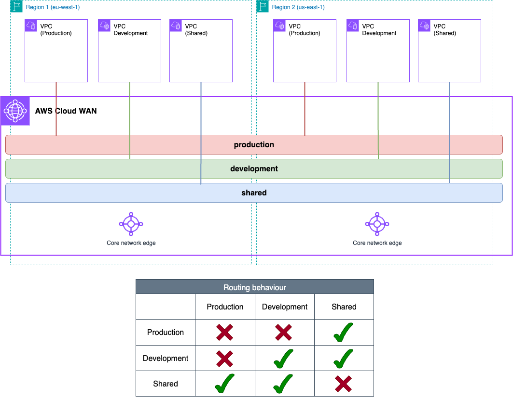

# AWS Cloud WAN simple architecture (AWS CloudFormation)



## Prerequisites
- An AWS account with an IAM user with the appropriate permissions

## Usage
- Clone the repository

```bash
git clone https://github.com/aws-samples/aws-cloud-wan-blueprints.git
```

- Move to the corresponding folder

```bash
cd patterns/1-simple_architecture/cloudformation
```

- (Optional) Edit the VPC CIDRs in the `workloads.yaml` file if you want to test with other values.
- Deploy the resources using `make deploy`.
- Remember to clean up resoures once you are done by using `make undeploy`.

**Note** EC2 instances will be deployed in all the Availability Zones configured for each VPC. Keep this in mind when testing this environment from a cost perspective - for production environments, we recommend the use of at least 2 AZs for high-availability.