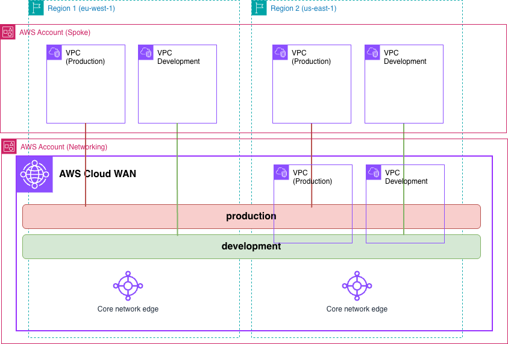

# AWS Cloud WAN simple architecture (AWS CloudFormation)



## Prerequisites
- Two AWS accounts with an IAM user with the appropriate permissions

## Usage

### Deployment
- Clone the repository and move to the folder

```bash
git clone https://github.com/aws-samples/aws-cloud-wan-blueprints.git
cd patterns/2-multi_account/cloudformation
```

- Assume credentials for the *Networking AWS Account* and deploy the `core_network.yaml` template. You will need to provide the Account ID for the *Spoke AWS Account*.

```bash
export SPOKE_ACCOUNT="{SPOKE_ACCOUNT_ID}"

aws cloudformation deploy --stack-name core-network-multi-account --template-file core_network.yaml --parameter-overrides SpokeAccount="${SPOKE_ACCOUNT}" --no-fail-on-empty-changeset --region us-east-1
```

- Once the stack is deployed, get the Core Network ID and ARN, and the RAM resource share ARN.

```bash
export CORENETWORK_ID=$(aws cloudformation describe-stacks --stack-name "core-network-multi-account" --query 'Stacks[0].Outputs[?OutputKey == `CoreNetworkId`].OutputValue' --output text --region us-east-1)
export CORENETWORK_ARN=$(aws cloudformation describe-stacks --stack-name "core-network-multi-account" --query 'Stacks[0].Outputs[?OutputKey == `CoreNetworkArn`].OutputValue' --output text --region us-east-1)
export RESOURCE_SHARE_ARN=$(aws cloudformation describe-stacks --stack-name "core-network-multi-account" --query 'Stacks[0].Outputs[?OutputKey == `ResourceShareArn`].OutputValue' --output text --region us-east-1)
```

- (Optional) Edit the VPC CIDRs in the `workloads.yaml` file if you want to test with other values.
- Assume credentials for the *Spoke AWS Account*. First, accept the resource share invitation.

```bash
export RESOURCE_SHARE_INVITATION_ARN=$(aws ram get-resource-share-invitations --resource-share-arns ${RESOURCE_SHARE_ARN} --region us-east-1 --query 'resourceShareInvitations[0].resourceShareInvitationArn' --output text)
aws ram accept-resource-share-invitation --resource-share-invitation-arn ${RESOURCE_SHARE_INVITATION_ARN} --region us-east-1
```

- Deploy the `workloads.yaml` template in the AWS Regions where Cloud WAN is deployed.

```bash
aws cloudformation deploy --stack-name multi-account-ireland --template-file workloads.yaml --parameter-overrides CoreNetworkId="${CORENETWORK_ID}" CoreNetworkArn="${CORENETWORK_ARN}" --capabilities CAPABILITY_IAM --no-fail-on-empty-changeset --region eu-west-1
aws cloudformation deploy --stack-name multi-account-nvirginia --template-file workloads.yaml --parameter-overrides CoreNetworkId="${CORENETWORK_ID}" CoreNetworkArn="${CORENETWORK_ARN}" --capabilities CAPABILITY_IAM --no-fail-on-empty-changeset --region us-east-1
```

**Note** EC2 instances will be deployed in all the Availability Zones configured for each VPC. Keep this in mind when testing this environment from a cost perspective - for production environments, we recommend the use of at least 2 AZs for high-availability.

### Clean-up
- Assume credentials for the *Spoke AWS Account*. Delete the deployed stacks.

```bash
aws cloudformation delete-stack --stack-name multi-account-ireland --region eu-west-1
aws cloudformation delete-stack --stack-name multi-account-nvirginia --region us-east-1
aws cloudformation wait stack-delete-complete --stack-name multi-account-ireland --region eu-west-1
aws cloudformation wait stack-delete-complete --stack-name multi-account-nvirginia --region us-east-1
```

- Assume credentials for the *Networking AWS Account*. Delete the deployed stack.

```bash
aws cloudformation delete-stack --stack-name core-network-multi-account --region us-east-1
aws cloudformation wait stack-delete-complete --stack-name core-network-multi-account --region us-east-1
```
