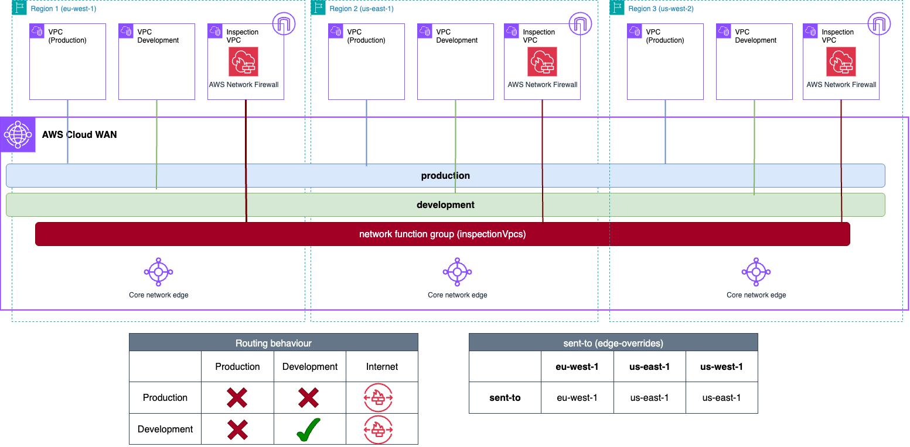

# AWS Cloud WAN Blueprints - Traffic Inspection architectures (Centralized Outbound)

This example shows a centralized egress and inspection architecture. The core network policy builds the following network:

- Three AWS Regions and two [segments](https://docs.aws.amazon.com/network-manager/latest/cloudwan/cloudwan-policy-segments.html).
    - *production* is isolated, meaning that VPCs within this segment won't be able to talk between each other.
    - *development* segment, where VPCs will be able to talk between each other within the segment.
    - An attachment policy rule that maps each spoke VPCs to the corresponding segment if the attachment contains the following tag: *domain={segment_name}*
- A [network function group](https://docs.aws.amazon.com/network-manager/latest/cloudwan/cloudwan-policy-network-function-groups.html) (NFG) for the inspection VPCs. An attachment policy rule that associates the inspection VPC to the NFG if the attachment includes the following tag: *inspection=true*.
- **Service Insertion rules**: in each routing domain's segment, a [send-to](https://docs.aws.amazon.com/network-manager/latest/cloudwan/cloudwan-policy-service-insertion.html#:~:text=insertion%2Denabled%20segment.-,Send%20to,-%E2%80%94%20Traffic%20flows%20north) action is created to send the default traffic (0.0.0.0/0 and ::/0) to the inspection VPCs.
  * A *with-edge-overrides* parameter is included to indicate that traffic from *us-west-2* should be inspected by *us-east-1* (given *us-west-2* don't have a local Inspection VPC).



```json
{
  "version": "2021.12",
  "core-network-configuration": {
    "vpn-ecmp-support": false,
    "asn-ranges": [
      "64520-65525"
    ],
    "edge-locations": [
      {
        "location": "eu-west-1"
      },
      {
        "location": "us-east-1"
      },
      {
        "location": "us-west-2"
      }
    ]
  },
  "attachment-policies": [
    {
      "rule-number": 100,
      "action": {
        "add-to-network-function-group": "inspectionVpcs"
      },
      "conditions": [
        {
          "type": "tag-value",
          "value": "true",
          "operator": "equals",
          "key": "inspection"
        }
      ]
    },
    {
      "rule-number": 200,
      "action": {
        "association-method": "tag",
        "tag-value-of-key": "domain"
      },
      "conditions": [
        {
          "type": "tag-exists",
          "key": "domain"
        }
      ]
    }
  ],
  "network-function-groups": [
    {
      "name": "inspectionVpcs",
      "require-attachment-acceptance": false
    }
  ],
  "segments": [
    {
      "isolate-attachments": true,
      "name": "production",
      "require-attachment-acceptance": false
    },
    {
      "name": "development",
      "require-attachment-acceptance": false
    }
  ],
  "segment-actions": [
    {
      "segment": "production",
      "action": "send-to",
      "via": {
        "with-edge-overrides": [
          {
            "edge-sets": [
              [
                "us-west-2"
              ]
            ],
            "use-edge-location": "us-east-1"
          }
        ],
        "network-function-groups": [
          "inspectionVpcs"
        ]
      },
      "when-sent-to": {
        "segments": "production"
      }
    },
    {
      "segment": "development",
      "action": "send-to",
      "via": {
        "with-edge-overrides": [
          {
            "edge-sets": [
              [
                "us-west-2"
              ]
            ],
            "use-edge-location": "us-east-1"
          }
        ],
        "network-function-groups": [
          "inspectionVpcs"
        ]
      },
      "when-sent-to": {
        "segments": "development"
      }
    }
  ]
}
```
