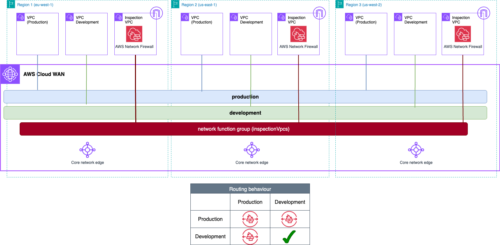
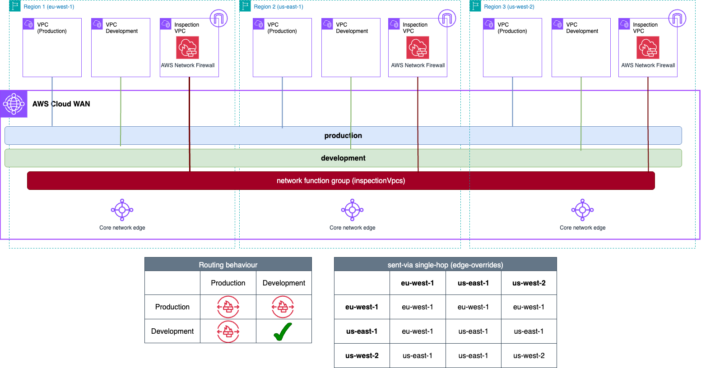

# AWS Cloud WAN Blueprints - Traffic Inspection architectures (East-West)

This example shows a centralized east-west inspection architecture. The core network policy builds the following network:

* 1 [segment](https://docs.aws.amazon.com/network-manager/latest/cloudwan/cloudwan-policy-segments.html) per routing domain - *production* (isolated) and *development*. Core Network's policy includes an attachment policy rule that maps each spoke VPCs to the corresponding segment if the attachment contains the following tag: *domain={segment_name}*
* 1 [network function group](https://docs.aws.amazon.com/network-manager/latest/cloudwan/cloudwan-policy-network-function-groups.html) (NFG) for the inspection VPCs. Core Network's policy includes an attachment policy rule that associates the inspection VPC to the NFG if the attachment includes the following tag: *inspection=true*.
* **Service Insertion rules**: one [send-via](https://docs.aws.amazon.com/network-manager/latest/cloudwan/cloudwan-policy-service-insertion.html#cloudwan-policy-service-insertion-modes) action to inspect the traffic between VPCs in the *production* segment, and between the *production* and *development* segments. **In this example, you can test both modes for send-via**:
    * **dual-hop (default)** - traffic traversing two AWS Regions is inspected in both of them.
    * **single-hop** - traffic traversing two AWS Regions is inspected in only one of them.

## dual-hop



```json
{
  "version": "2021.12",
  "core-network-configuration": {
    "asn-ranges": [
      "64520-65525"
    ],
    "vpn-ecmp-support": false,
    "edge-locations": [
      {
        "location": "eu-west-1"
      },
      {
        "location": "us-east-1"
      },
      {
        "location": "us-west-2"
      }
    ],
    "dns-support": true,
    "security-group-referencing-support": false
  },
  "segments": [
    {
      "name": "development",
      "isolate-attachments": false,
      "require-attachment-acceptance": false
    },
    {
      "name": "production",
      "isolate-attachments": true,
      "require-attachment-acceptance": false
    }
  ],
  "network-function-groups": [
    {
      "name": "inspectionVpcs",
      "require-attachment-acceptance": false
    }
  ],
  "segment-actions": [
    {
      "action": "send-via",
      "segment": "production",
      "mode": "dual-hop",
      "when-sent-to": {
        "segments": [
          "development"
        ]
      },
      "via": {
        "network-function-groups": [
          "inspectionVpcs"
        ]
      }
    },
    {
      "action": "send-via",
      "segment": "production",
      "mode": "dual-hop",
      "via": {
        "network-function-groups": [
          "inspectionVpcs"
        ]
      },
      "when-sent-to": {
        "segments": "production"
      }
    }
  ],
  "attachment-policies": [
    {
      "rule-number": 100,
      "condition-logic": "or",
      "conditions": [
        {
          "type": "tag-value",
          "operator": "equals",
          "key": "inspection",
          "value": "true"
        }
      ],
      "action": {
        "add-to-network-function-group": "inspectionVpcs"
      }
    },
    {
      "rule-number": 200,
      "condition-logic": "or",
      "conditions": [
        {
          "type": "tag-exists",
          "key": "domain"
        }
      ],
      "action": {
        "association-method": "tag",
        "tag-value-of-key": "domain"
      }
    }
  ]
}
```

## single-hop



```json
{
  "version": "2021.12",
  "core-network-configuration": {
    "asn-ranges": [
      "64520-65525"
    ],
    "vpn-ecmp-support": false,
    "edge-locations": [
      {
        "location": "eu-west-1"
      },
      {
        "location": "us-east-1"
      },
      {
        "location": "us-west-2"
      }
    ],
    "dns-support": true,
    "security-group-referencing-support": false
  },
  "segments": [
    {
      "name": "development",
      "isolate-attachments": false,
      "require-attachment-acceptance": false
    },
    {
      "name": "production",
      "isolate-attachments": true,
      "require-attachment-acceptance": false
    }
  ],
  "network-function-groups": [
    {
      "name": "inspectionVpcs",
      "require-attachment-acceptance": false
    }
  ],
  "segment-actions": [
    {
      "action": "send-via",
      "segment": "production",
      "mode": "single-hop",
      "when-sent-to": {
        "segments": [
          "development"
        ]
      },
      "via": {
        "network-function-groups": [
          "inspectionVpcs"
        ],
        "with-edge-overrides": [
          {
            "edge-sets": [
              [
                "eu-west-1",
                "us-west-2"
              ],
              [
                "us-east-1",
                "eu-west-1"
              ]
            ],
            "use-edge-location": "eu-west-1"
          },
          {
            "edge-sets": [
              [
                "us-east-1",
                "us-west-2"
              ]
            ],
            "use-edge-location": "us-east-1"
          }
        ]
      }
    },
    {
      "action": "send-via",
      "segment": "production",
      "mode": "single-hop",
      "via": {
        "network-function-groups": [
          "inspectionVpcs"
        ],
        "with-edge-overrides": [
          {
            "edge-sets": [
              [
                "eu-west-1",
                "us-west-2"
              ],
              [
                "us-east-1",
                "eu-west-1"
              ]
            ],
            "use-edge-location": "eu-west-1"
          },
          {
            "edge-sets": [
              [
                "us-east-1",
                "us-west-2"
              ]
            ],
            "use-edge-location": "us-east-1"
          }
        ]
      },
      "when-sent-to": {
        "segments": "production"
      }
    }
  ],
  "attachment-policies": [
    {
      "rule-number": 100,
      "condition-logic": "or",
      "conditions": [
        {
          "type": "tag-value",
          "operator": "equals",
          "key": "inspection",
          "value": "true"
        }
      ],
      "action": {
        "add-to-network-function-group": "inspectionVpcs"
      }
    },
    {
      "rule-number": 200,
      "condition-logic": "or",
      "conditions": [
        {
          "type": "tag-exists",
          "key": "domain"
        }
      ],
      "action": {
        "association-method": "tag",
        "tag-value-of-key": "domain"
      }
    }
  ]
}
```
