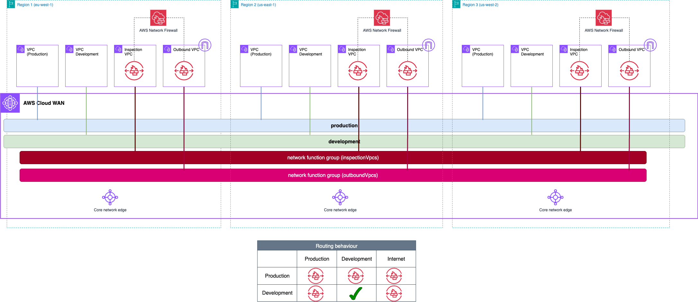

# AWS Cloud WAN Blueprints - Traffic Inspection architectures (Centralized Outbound & East-West dual-hop)

This example shows a centralized east-west inspection architecture. The core network policy builds the following network:

* 1 [segment](https://docs.aws.amazon.com/network-manager/latest/cloudwan/cloudwan-policy-segments.html) per routing domain - *production* (isolated) and *development*. Core Network's policy includes an attachment policy rule that maps each spoke VPCs to the corresponding segment if the attachment contains the following tag: *domain={segment_name}*
* 2 [network function groups](https://docs.aws.amazon.com/network-manager/latest/cloudwan/cloudwan-policy-network-function-groups.html) (NFG) for the inspection and outbound VPCs. Core Network's policy includes the following attachment policy rules:
    * The tag *inspection=true* will associate a VPC to the *inspectionVpcs* NFG..
    * The tag *outbound=true* will associate a VPC to the *outboundVpcs* NFG..
* **Service Insertion rules**: 
    * One [send-via](https://docs.aws.amazon.com/network-manager/latest/cloudwan/cloudwan-policy-service-insertion.html#cloudwan-policy-service-insertion-modes) action to inspect the traffic between VPCs in the *production* segment, and between the *production* and *development* segments. This example makes use of the **dual-hop** mode - traffic traversing two AWS Regions is inspected in both of them.
    * In each routing domain's segment, a [send-to](https://docs.aws.amazon.com/network-manager/latest/cloudwan/cloudwan-policy-service-insertion.html#cloudwan-policy-service-insertion-modes) action is created to send the default traffic (0.0.0.0/0 and ::/0) to the outbound VPCs.

**Why 2 VPCs with a firewall endpoint and two NFGs?**. The action `send-to` is single-hop by design, and you cannot configure a NFG with both single-hop and dual-hop modes. We need to use two NFGs and, given a VPC cannot be attached to 2 segments/NFGs, two VPCs (inspection & outbound). In addition, in this example, we take advantage of [multi-VPC endpoints](https://aws.amazon.com/about-aws/whats-new/2025/05/aws-network-firewall-multiple-vpc-endpoints/) in AWS Network Firewall to use the same firewall resource in both VPCs - and avoid extra cost and operational overhead managing two resources.



```json
{
  "core-network-configuration": {
    "version": "2021.12",
    "vpn-ecmp-support": false,
    "asn-ranges": [
      "64520-65525"
    ],
    "edge-locations": [
      {
        "location": "eu-west-1"
      },
      {
        "location": "us-east-1"
      },
      {
        "location": "us-west-2"
      }
    ]
  },
  "attachment-policies": [
    {
      "rule-number": 100,
      "action": {
        "add-to-network-function-group": "inspectionVpcs"
      },
      "conditions": [
        {
          "type": "tag-value",
          "value": "true",
          "operator": "equals",
          "key": "inspection"
        }
      ]
    },
    {
      "rule-number": 200,
      "action": {
        "add-to-network-function-group": "outboundVpcs"
      },
      "conditions": [
        {
          "type": "tag-value",
          "value": "true",
          "operator": "equals",
          "key": "outbound"
        }
      ]
    },
    {
      "rule-number": 300,
      "action": {
        "association-method": "tag",
        "tag-value-of-key": "domain"
      },
      "conditions": [
        {
          "type": "tag-exists",
          "key": "domain"
        }
      ]
    }
  ],
  "network-function-groups": [
    {
      "name": "inspectionVpcs",
      "require-attachment-acceptance": false
    },
    {
      "name": "outboundVpcs",
      "require-attachment-acceptance": false
    }
  ],
  "segments": [
    {
      "isolate-attachments": true,
      "name": "production",
      "require-attachment-acceptance": false
    },
    {
      "name": "development",
      "require-attachment-acceptance": false
    }
  ],
  "segment-actions": [
    {
      "mode": "dual-hop",
      "when-sent-to": {
        "segments": "*"
      },
      "segment": "production",
      "action": "send-via",
      "via": {
        "network-function-groups": [
          "inspectionVpcs"
        ]
      }
    },
    {
      "segment": "production",
      "action": "send-to",
      "via": {
        "network-function-groups": [
          "outboundVpcs"
        ]
      },
      "when-sent-to": {
        "segments": "production"
      }
    },
    {
      "segment": "development",
      "action": "send-to",
      "via": {
        "network-function-groups": [
          "outboundVpcs"
        ]
      },
      "when-sent-to": {
        "segments": "development"
      }
    }
  ]
}
```