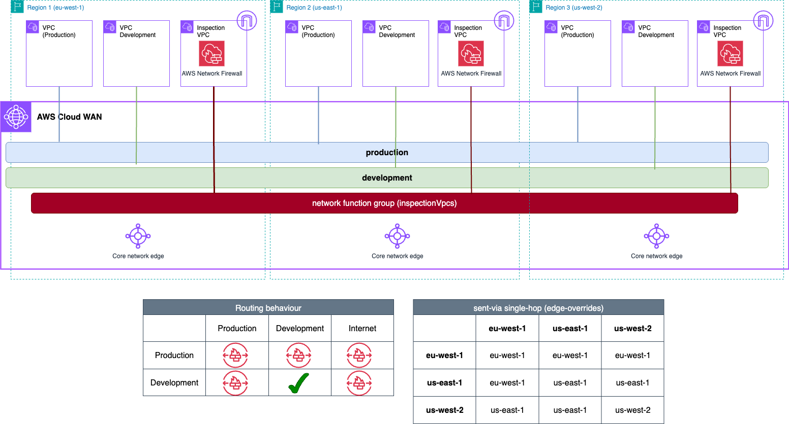

# AWS Cloud WAN Blueprints - Traffic Inspection architectures (Centralized Outbound & East-West single-hop)



## Prerequisites
- An AWS account with an IAM user with the appropriate permissions.
- Terraform installed.

## Code Principles:
- Writing DRY (Do No Repeat Yourself) code using a modular design pattern

## Usage
- Clone the repository

```bash
git clone https://github.com/aws-samples/aws-cloud-wan-blueprints.git
```

- Move to the corresponding folder

```bash
cd patterns/3-traffic_inspection/4-outbound_east_west_singlehop/terraform
```

- (Optional) Edit the variables.tf file in the project root directory - if you want to test with different parameters.
- Deploy the resources using `terraform apply`.
- Remember to clean up resoures once you are done by using `terraform destroy`.

**Note** EC2 instances and AWS Network Firewall endpoints will be deployed in all the Availability Zones configured for each VPC. Keep this in mind when testing this environment from a cost perspective - for production environments, we recommend the use of at least 2 AZs for high-availability.
