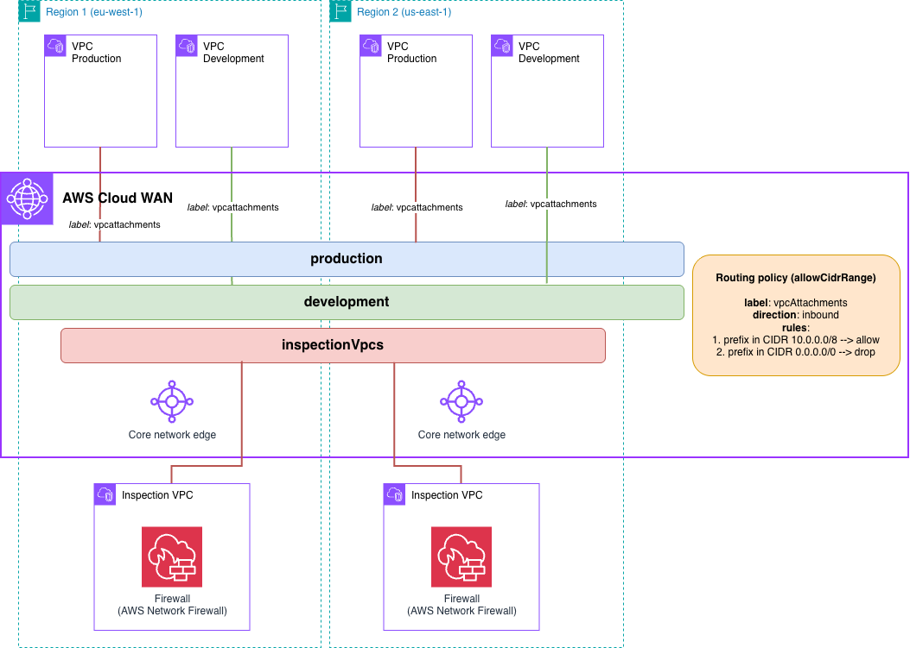

# AWS Cloud WAN Traffic Inspection After Filtering (Terraform)



## Prerequisites

- **AWS Account**: With appropriate IAM permissions
- **Terraform**: >= 1.3.0 installed
- **AWS CLI**: Configured with credentials (optional, for verification)
- **Permissions required**:
  - Network Manager
  - EC2: VPC, subnets, instances, endpoints, Network Firewall
  - IAM: Create roles and policies

## Deployment

```bash
# Clone the repository
git clone https://github.com/aws-samples/aws-cloud-wan-blueprints.git

# Navigate to the Terraform directory
cd patterns/4-routing_policies/3-inspection_after_filtering/terraform

# Initialize Terraform
terraform init

# (Optional) Review the planned changes
terraform plan

# Deploy the resources
terraform apply
```

### Attach Routing Policy Labels

> **Note**: This manual step is required until the AWS or AWSCC Terraform providers support routing policy label attachment natively. We will update this pattern as soon as provider support becomes available.

After deployment, attach routing policy labels to VPC attachments using the AWS CLI:

```bash
# Get the Core Network ID and VPC attachment IDs
CORE_NETWORK_ID=$(terraform output -json cloud_wan | jq -r '.core_network')
VPC_IRELAND_PROD=$(terraform output -json vpcs | jq -r '.ireland.attachment_ids.prod')
VPC_IRELAND_DEV=$(terraform output -json vpcs | jq -r '.ireland.attachment_ids.dev')
VPC_NVIRGINIA_PROD=$(terraform output -json vpcs | jq -r '.nvirginia.attachment_ids.prod')
VPC_NVIRGINIA_DEV=$(terraform output -json vpcs | jq -r '.nvirginia.attachment_ids.dev')

# Attach routing policy labels
aws networkmanager put-attachment-routing-policy-label \
  --core-network-id $CORE_NETWORK_ID \
  --attachment-id $VPC_IRELAND_PROD \
  --routing-policy-label vpcAttachments \
  --region eu-west-1

aws networkmanager put-attachment-routing-policy-label \
  --core-network-id $CORE_NETWORK_ID \
  --attachment-id $VPC_IRELAND_DEV \
  --routing-policy-label vpcAttachments \
  --region eu-west-1

aws networkmanager put-attachment-routing-policy-label \
  --core-network-id $CORE_NETWORK_ID \
  --attachment-id $VPC_NVIRGINIA_PROD \
  --routing-policy-label vpcAttachments \
  --region us-east-1

aws networkmanager put-attachment-routing-policy-label \
  --core-network-id $CORE_NETWORK_ID \
  --attachment-id $VPC_NVIRGINIA_DEV \
  --routing-policy-label vpcAttachments \
  --region us-east-1
```

> **Note**: EC2 instances will be deployed in all the Availability Zones configured for each VPC. Keep this in mind when testing this environment from a cost perspective - for production environments, we recommend the use of at least 2 AZs for high-availability.

## Cleanup

```bash
# Destroy all resources
terraform destroy
```

## Next Steps

After successfully deploying this pattern:

1. **Explore the architecture**: Review routing policies, Network Function Groups, and service insertion in Network Manager console
2. **Test connectivity**: Verify traffic between production and development segments flows through inspection VPCs
3. **Verify filtering**: Confirm secondary CIDR blocks (100.64.0.0/16) are filtered and not propagated
4. **Check firewall logs**: Review AWS Network Firewall logs to see inspected traffic
5. **Try modifications**: Adjust routing policies to filter different CIDR ranges or add more segments
