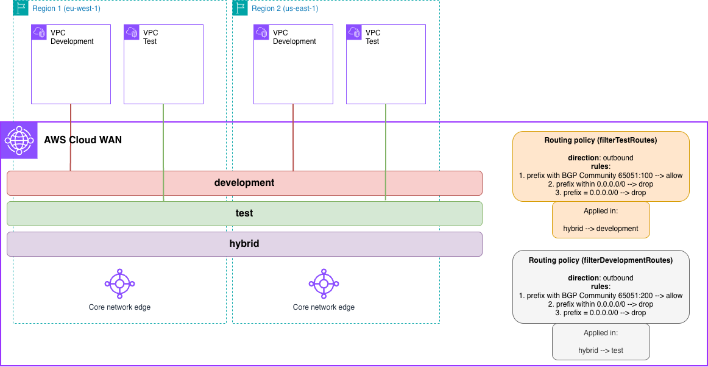

# AWS Cloud WAN Hybrid Path Influence (AWS CloudFormation)



> **⚠️ Hybrid Environment Required**: This pattern requires you to establish two hybrid connections (Site-to-Site VPN or Connect attachments) in different AWS regions, both announcing the same route prefix. The IaC code creates the Cloud WAN infrastructure, but you must configure your on-premises routers to establish BGP sessions and advertise routes.

## Prerequisites

- **AWS Account**: With appropriate IAM permissions
- **AWS CLI**: Installed and configured with credentials
- **Permissions required**:
  - CloudFormation
  - Network Manager
  - EC2: VPC, subnets, instances, endpoints
  - IAM: Create roles and policies
- **Make**: Installed
- **Hybrid Connectivity**: Two Site-to-Site VPN or Connect attachments in different regions

## Deployment

```bash
# Clone the repository
git clone https://github.com/aws-samples/aws-cloud-wan-blueprints.git

# Navigate to the CloudFormation directory
cd patterns/4-routing_policies/5-influencing_hybrid_path_between_cnes/cloudformation

# Deploy everything
make deploy

# Or deploy step-by-step:
make deploy-cloudwan    # Deploy Core Network first
make deploy-workloads   # Then deploy workloads in both regions
```

> **Note**: This pattern influences traffic paths between AWS Regions using AS-PATH prepending. For end-to-end testing, establish hybrid connections in us-east-1 (ASN 65052) and eu-west-2 (ASN 65058) announcing the same route. EC2 instances will be deployed in all the Availability Zones configured for each VPC. Keep this in mind when testing this environment from a cost perspective - for production environments, we recommend the use of at least 2 AZs for high-availability.

## Cleanup

```bash
# Delete everything
make undeploy

# Or delete step-by-step:
make undeploy-workloads  # Delete workloads first
make undeploy-cloudwan   # Then delete Core Network
```

## Next Steps

After successfully deploying this pattern:

1. **Explore the architecture**: Review routing policies and CNE-to-CNE associations in Network Manager console
2. **Test connectivity**: Establish hybrid connectivity and verify path selection via AS-PATH manipulation
3. **Try modifications**: Adjust AS-PATH prepending, test different region pairs
4. **Advanced patterns**: Combine with other routing policies for complex scenarios
