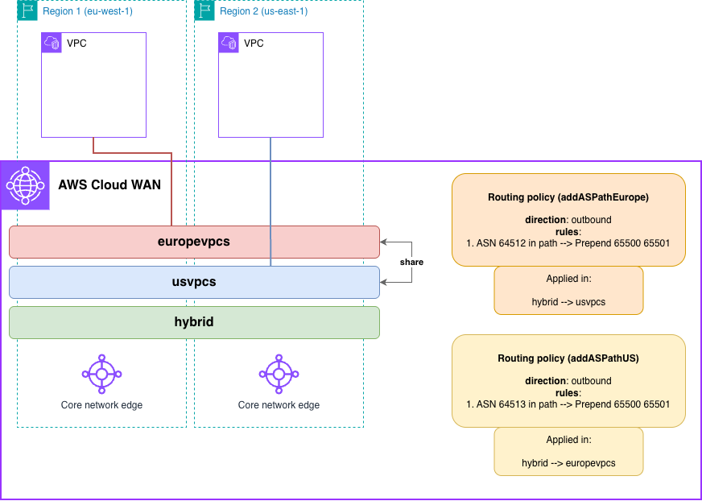

# AWS Cloud WAN Direct Connect Gateway (DXGW) Path Influence (AWS CloudFormation)



> **⚠️ Hybrid Environment Required**: This pattern requires you to establish Direct Connect connections and Virtual Interfaces (VIFs) through two Direct Connect Gateways (DXGWs) in different geographical locations, both announcing the same route prefix. The IaC code creates the Cloud WAN infrastructure, but you must configure your on-premises routers to establish BGP sessions and advertise routes.

## Prerequisites

- **AWS Account**: With appropriate IAM permissions
- **AWS CLI**: Installed and configured with credentials
- **Permissions required**:
  - CloudFormation
  - Network Manager
  - EC2: VPC, subnets, instances, endpoints
  - IAM: Create roles and policies
  - Direct Connect: Create and manage Direct Connect Gateways
- **Make**: Installed
- **Hybrid Connectivity**: Direct Connect connections through two DXGWs in different regions

## Deployment

```bash
# Clone the repository
git clone https://github.com/aws-samples/aws-cloud-wan-blueprints.git

# Navigate to the CloudFormation directory
cd patterns/4-routing_policies/6-influencing_dxgw_hybrid_path/cloudformation

# Deploy everything
make deploy

# Or deploy step-by-step:
make deploy-cloudwan    # Deploy Core Network first
make deploy-workloads   # Then deploy workloads in both regions
```

> **Note**: For end-to-end testing, establish Direct Connect connections and VIFs through the Europe DXGW (ASN 64512) and US DXGW (ASN 64513) announcing the same route - you will need to change ASN values in the Core Network policy if you want to use other values. EC2 instances will be deployed in all the Availability Zones configured for each VPC. Keep this in mind when testing this environment from a cost perspective - for production environments, we recommend the use of at least 2 AZs for high-availability.

## Cleanup

```bash
# Delete everything
make undeploy

# Or delete step-by-step:
make undeploy-workloads  # Delete workloads first
make undeploy-cloudwan   # Then delete Core Network
```

## Next Steps

After successfully deploying this pattern:

1. **Explore the architecture**: Review routing policies and segment sharing in Network Manager console
2. **Test connectivity**: Establish Direct Connect connections and verify path selection via AS-PATH manipulation
3. **Try modifications**: Adjust AS-PATH prepending, test different DXGW configurations
