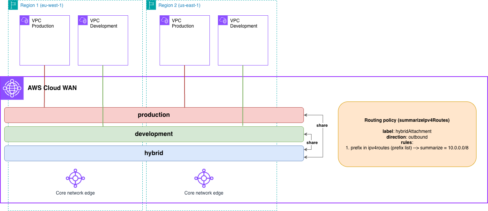

# AWS Cloud WAN Route Summarization (AWS CloudFormation)



> **⚠️ Hybrid Environment Required**: This pattern requires you to establish hybrid connectivity (Site-to-Site VPN, Connect attachment, or Direct Connect Gateway) with BGP configuration to test end-to-end. The IaC code creates the Cloud WAN infrastructure, but you must configure your on-premises router to establish BGP sessions.

## Prerequisites

- **AWS Account**: With appropriate IAM permissions
- **AWS CLI**: Installed and configured with credentials
- **Permissions required**:
  - CloudFormation
  - Network Manager
  - EC2: VPC, subnets, instances, endpoints, prefix lists
  - IAM: Create roles and policies
- **Make**: Installed
- **Hybrid Connectivity**: Site-to-Site VPN, Connect attachment, or Direct Connect Gateway for full testing

## Deployment

```bash
# Clone the repository
git clone https://github.com/aws-samples/aws-cloud-wan-blueprints.git

# Navigate to the CloudFormation directory
cd patterns/4-routing_policies/7-summarization/cloudformation

# Deploy everything
make deploy

# Or deploy step-by-step:
make deploy-cloudwan    # Deploy Core Network (with base policy configuration)
make deploy-prefixlist  # Deploy prefix list and associate it to Cloud WAN
make deploy-workloads   # Deploy VPC and EC2 instances
make update-cloudwan    # Update Core Network policy with prefix list reference
```

> **Important Notes**:
> 1. **Prefix List Association Region**: The prefix list association MUST be created in `us-west-2` as it is Cloud WAN's home region, regardless of where your Core Network edge locations are deployed.
> 2. **Routing Policy Label**: After deployment, when you create your hybrid connections (Site-to-Site VPN, Connect, or Direct Connect Gateway), you MUST add the routing policy label `hybridAttachment` to the attachment for the summarization policy to be applied.
> 3. **Dual-Stack VPCs**: VPCs are deployed as dual-stack (IPv4 and IPv6), but the summarization policy only applies to IPv4 CIDR blocks. IPv6 routes will be advertised without summarization.

## Cleanup

```bash
# Delete everything
make undeploy

# Or delete step-by-step:
make undeploy-workloads        # Delete workloads first
make undeploy-update-cloudwan  # Update Core Network policy (to base policy configuration) to remove prefix list reference
make undeploy-prefixlist       # Delete prefix list association and related resources
make undeploy-cloudwan         # Then delete Core Network
```

## Next Steps

After successfully deploying this pattern:

1. **Explore the architecture**: Review routing policies and prefix list associations in Network Manager console
2. **Test connectivity**: Establish hybrid connectivity with the `hybridAttachment` routing policy label
3. **Verify summarization**: Check BGP routes advertised to on-premises to confirm summarization is working
4. **Try modifications**: Adjust summary routes, add more prefix lists, test different summarization scenarios
