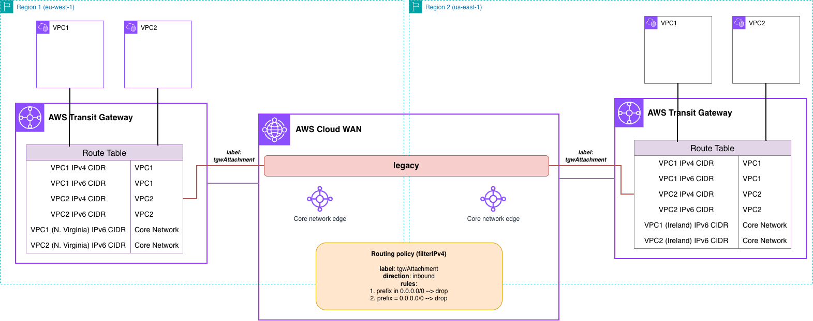

# AWS Cloud WAN Filtering Peered Transit Gateways (Terraform)



## Prerequisites

- **AWS Account**: With appropriate IAM permissions
- **Terraform**: >= 1.3.0 installed
- **AWS CLI**: Configured with credentials (optional, for verification)
- **Permissions required**:
  - Network Manager
  - EC2: VPC, subnets, Transit Gateway, instances, endpoints
  - IAM: Create roles and policies

## Deployment

```bash
# Clone the repository
git clone https://github.com/aws-samples/aws-cloud-wan-blueprints.git

# Navigate to the Terraform directory
cd patterns/4-routing_policies/8-filtering_peered_tgw/terraform

# Initialize Terraform
terraform init

# (Optional) Review the planned changes
terraform plan

# Deploy the resources
terraform apply
```

> **Note**: EC2 instances will be deployed in all the Availability Zones configured for each VPC. Keep this in mind when testing this environment from a cost perspective - for production environments, we recommend the use of at least 2 AZs for high-availability.

## Cleanup

```bash
# Destroy all resources
terraform destroy
```

## Next Steps

After successfully deploying this pattern:

1. **Explore the architecture**: Review Transit Gateway peering with routing policies in Network Manager console
2. **Test connectivity**: Verify IPv4 routes are filtered and only IPv6 connectivity works between regions
3. **Try modifications**: Adjust routing policies to filter different route types or protocols
