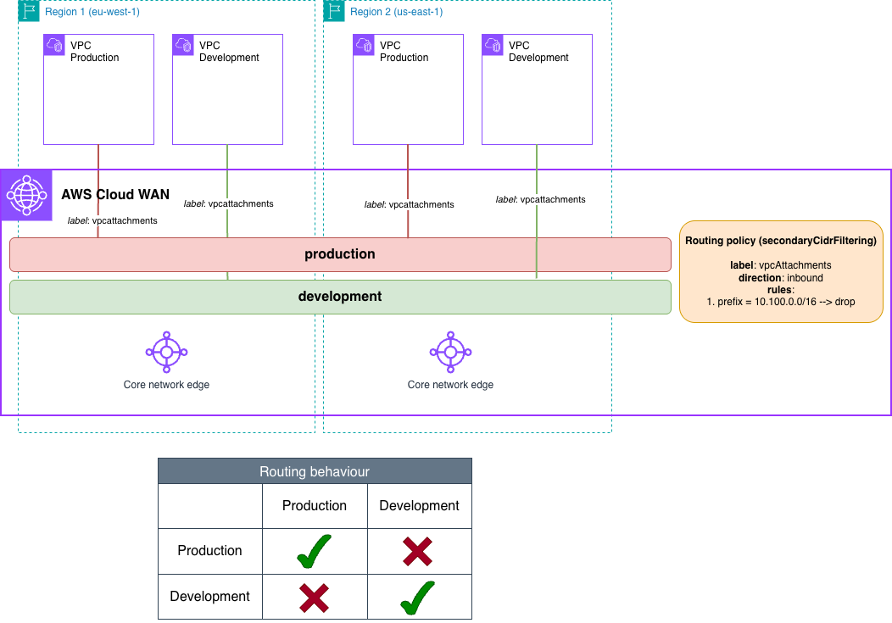
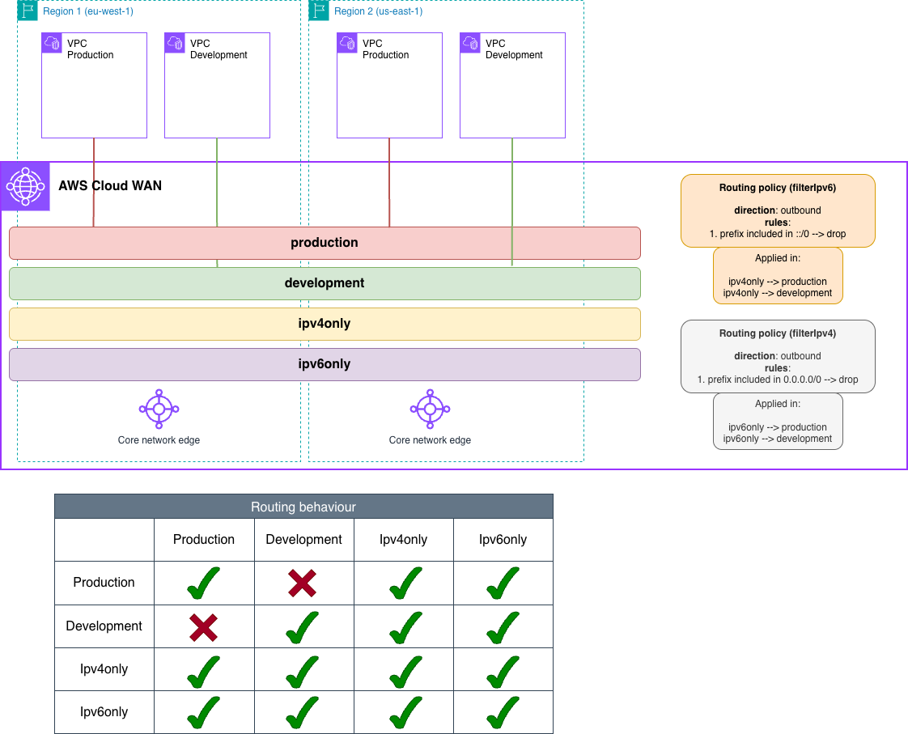
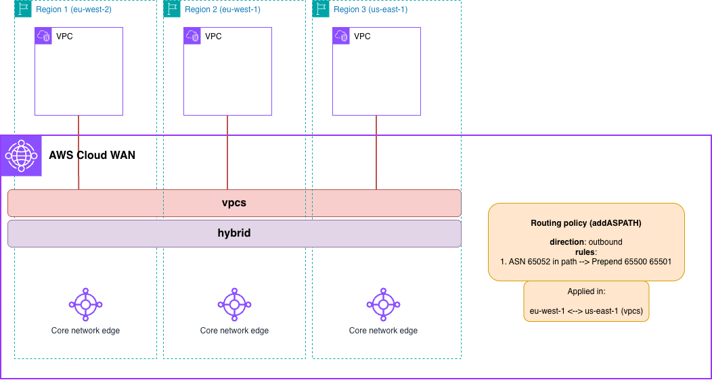

# AWS Cloud WAN Blueprints - Routing Policies

## Overview

This section demonstrates advanced routing policy capabilities in AWS Cloud WAN, providing fine-grained control over route filtering, summarization, and BGP configuration control across your global network. Routing policies enable you to implement sophisticated routing scenarios that go beyond basic segment connectivity.

**Use these patterns to**:

- Filter unwanted routes from your attachments (secondary CIDRs, specific prefixes), between segments, or between AWS Regions
- Segment hybrid traffic using BGP communities
- Influence traffic paths between regions using AS-PATH manipulation
- Implement advanced routing controls for complex network architectures

## Routing Policy Patterns

| Pattern | Description | Policy Type | IaC Support |
|---------|-------------|-------------|-------------|
| [1. Filtering Secondary CIDR Blocks](#1-filtering-secondary-cidr-blocks-in-vpc-attachments) | Filter internal VPC CIDR blocks from propagation | Route Filtering | Terraform |
| [2. IPv4/IPv6 Segment Separation](#2-creating-ipv4-and-ipv6-only-segments) | Create protocol-specific segments | Route Filtering | Terraform |
| [4. BGP Community Filtering](#4-filtering-routes-using-bgp-communities) | Segment hybrid traffic by BGP community | Route Filtering + BGP | Terraform |
| [5. Hybrid Path Influence](#5-influencing-hybrid-path-between-aws-regions) | Control inter-region traffic paths | Path Preferences | Terraform |
| [6. Direct Connect Gateway Path Influence](#6-influencing-direct-connect-gateway-hybrid-path) | Prefer specific DXGW paths for regional traffic | Path Preferences | Terraform |

---

## 1. Filtering Secondary CIDR Blocks in VPC Attachments

This pattern shows how you can filters secondary CIDR blocks from VPC attachments to prevent internal-only ranges from propagating to the broader network. VPCs often have secondary CIDR blocks for internal-only traffic (e.g., Kubernetes pod networks, cluster communication). These ranges should not propagate to avoid undesired routing behaviors.



### Key Components

| Component | Configuration |
|-----------|---------------|
| **Regions** | us-east-1, eu-west-1 |
| **Segments** | `production`, `development` |
| **Routing Policy** | Filter 10.100.0.0/16 (secondary CIDR) |
| **Policy Direction** | `inbound` (VPC attachments only support inbound) |
| **Policy Association** | To attachments via routing policy label `vpcAttachments` |

### Traffic Flow

| Source | Destination | Result | Reason |
|--------|-------------|--------|--------|
| Production VPC A | Production VPC B | ✅ Allowed | Primary CIDR blocks propagated to segment |
| Development VPC A | Development VPC B | ✅ Allowed | Primary CIDR blocks propagated to segment |
| Production VPC | Development VPC | ❌ Blocked | No segment sharing |

### Implementation

| IaC Tool | Location |
|----------|----------|
| **CloudFormation** | [`./1-filtering_vpc_secondary_cidr_blocks/cloudformation/`](./1-filtering_vpc_secondary_cidr_blocks/cloudformation/) |
| **Terraform** | [`./1-filtering_vpc_secondary_cidr_blocks/terraform/`](./1-filtering_vpc_secondary_cidr_blocks/terraform/) |

<details>
<summary>View Network Policy</summary>

```json
{
  "version": "2025.11",
  "core-network-configuration": {
    "vpn-ecmp-support": true,
    "dns-support": true,
    "security-group-referencing-support": true,
    "asn-ranges": [
      "65000-65003"
    ],
    "edge-locations": [
      {
        "location": "us-east-1",
        "asn": 65000
      },
      {
        "location": "eu-west-1",
        "asn": 65001
      }
    ]
  },
  "segments": [
    {
      "name": "production",
      "require-attachment-acceptance": false
    },
    {
      "name": "development",
      "require-attachment-acceptance": false
    }
  ],
  "attachment-policies": [
    {
      "rule-number": 100,
      "condition-logic": "and",
      "conditions": [
        {
          "type": "attachment-type",
          "operator": "equals",
          "value": "vpc"
        },
        {
          "type": "tag-exists",
          "key": "domain"
        }
      ],
      "action": {
        "association-method": "tag",
        "tag-value-of-key": "domain"
      }
    }
  ],
  "attachment-routing-policy-rules": [
    {
      "rule-number": 100,
      "conditions": [
        {
          "type": "routing-policy-label",
          "value": "vpcAttachments"
        }
      ],
      "action": {
        "associate-routing-policies": [
          "secondaryCidrFiltering"
        ]
      }
    }
  ],
  "routing-policies": [
    {
      "routing-policy-name": "secondaryCidrFiltering",
      "routing-policy-description": "Attachment IPv4 secondary CIDR block filtering",
      "routing-policy-direction": "inbound",
      "routing-policy-number": 100,
      "routing-policy-rules": [
        {
          "rule-number": 100,
          "rule-definition": {
            "match-conditions": [
              {
                "type": "prefix-equals",
                "value": "10.100.0.0/16"
              }
            ],
            "condition-logic": "or",
            "action": {
              "type": "drop"
            }
          }
        }
      ]
    }
  ]
}
```
</details>

---

## 2. Creating IPv4 and IPv6 Only Segments

This patterns shows how you can create protocol-specific segments by filtering IPv4 or IPv6 routes when sharing between dual-stack and single-stack segments. You may want to take advantage of the filtering capability when sharing segments when dual-stack VPCs need to share routes with protocol-specific segments for specialized workloads or compliance requirements (e.g., IPv6-only applications, legacy IPv4-only systems).



### Key Components

| Component | Configuration |
|-----------|---------------|
| **Regions** | us-east-1, eu-west-1 |
| **Segments** | `production`, `development` (dual-stack), `ipv4only`, `ipv6only` |
| **Routing Policies** | `filterIpv4` (drops 0.0.0.0/0), `filterIpv6` (drops ::/0) |
| **Policy Direction** | `inbound` |
| **Segment Actions** | Share with filtering between dual-stack and single-stack |

### Traffic Flow

| Source | Destination | Result | Route Filtering | Reason |
|--------|-------------|--------|-----------------|--------|
| Prod/Dev VPC (IPv4) | ipv4only segment VPC (IPv4) | ✅ Allowed | ✅ IPv4 allowed | IPv6 routes filtered, IPv4 routes shared |
| Prod/Dev VPC (IPv6) | ipv4only segment VPC | ❌ Blocked | ❌ IPv6 filtered | IPv6 routes dropped by `filterIpv6` policy |
| Prod/Dev VPC (IPv6) | ipv6only segment VPC (IPv6) | ✅ Allowed | ✅ IPv6 allowed | IPv4 routes filtered, IPv6 routes shared |
| Prod/Dev VPC (IPv4) | ipv6only segment VPC | ❌ Blocked | ❌ IPv4 filtered | IPv4 routes dropped by `filterIpv4` policy |
| Production VPC | Production VPC | ❌ Blocked | N/A | No segment sharing |
| ipv4only VPC | ipv6only VPC | ❌ Blocked | N/A | No segment sharing |

### Implementation

| IaC Tool | Location |
|----------|----------|
| **CloudFormation** | [`./2-filtering_ipv4_ipv6_only_segments/cloudformation/`](./2-filtering_ipv4_ipv6_only_segments/cloudformation/) |
| **Terraform** | [`./2-filtering_ipv4_ipv6_only_segments/terraform/`](./2-filtering_ipv4_ipv6_only_segments/terraform/) |

<details>
<summary>View Network Policy</summary>

```json
{
  "version": "2025.11",
  "core-network-configuration": {
    "vpn-ecmp-support": true,
    "dns-support": true,
    "security-group-referencing-support": true,
    "asn-ranges": [
      "65000-65003"
    ],
    "edge-locations": [
      {
        "location": "us-east-1",
        "asn": 65000
      },
      {
        "location": "eu-west-1",
        "asn": 65001
      }
    ]
  },
  "segments": [
    {
      "name": "production",
      "require-attachment-acceptance": false
    },
    {
      "name": "development",
      "require-attachment-acceptance": false
    },
    {
      "name": "ipv4only"
    },
    {
      "name": "ipv6only"
    }
  ],
  "attachment-policies": [
    {
      "rule-number": 100,
      "condition-logic": "and",
      "conditions": [
        {
          "type": "attachment-type",
          "operator": "equals",
          "value": "vpc"
        },
        {
          "type": "tag-exists",
          "key": "domain"
        }
      ],
      "action": {
        "association-method": "tag",
        "tag-value-of-key": "domain"
      }
    }
  ],
  "segment-actions": [
    {
      "action": "share",
      "mode": "attachment-route",
      "segment": "ipv4only",
      "share-with": ["production"],
      "routing-policy-names": ["filterIpv6"]
    },
    {
      "action": "share",
      "mode": "attachment-route",
      "segment": "ipv4only",
      "share-with": ["development"],
      "routing-policy-names": ["filterIpv6"]
    },
    {
      "action": "share",
      "mode": "attachment-route",
      "segment": "ipv6only",
      "share-with": ["production"],
      "routing-policy-names": ["filterIpv4"]
    },
    {
      "action": "share",
      "mode": "attachment-route",
      "segment": "ipv6only",
      "share-with": ["development"],
      "routing-policy-names": ["filterIpv4"]
    }
  ],
  "routing-policies": [
    {
      "routing-policy-name": "filterIpv4",
      "routing-policy-description": "Filtering all IPv4 ranges",
      "routing-policy-direction": "inbound",
      "routing-policy-number": 100,
      "routing-policy-rules": [
        {
          "rule-number": 100,
          "rule-definition": {
            "match-conditions": [
              {
                "type": "prefix-in-cidr",
                "value": "0.0.0.0/0"
              }
            ],
            "condition-logic": "or",
            "action": {
              "type": "drop"
            }
          }
        }
      ]
    },
    {
      "routing-policy-name": "filterIpv6",
      "routing-policy-description": "Filtering all IPv6 ranges",
      "routing-policy-direction": "inbound",
      "routing-policy-number": 200,
      "routing-policy-rules": [
        {
          "rule-number": 100,
          "rule-definition": {
            "match-conditions": [
              {
                "type": "prefix-in-cidr",
                "value": "::/0"
              }
            ],
            "condition-logic": "or",
            "action": {
              "type": "drop"
            }
          }
        }
      ]
    }
  ]
}
```
</details>

---

## 3. Traffic Inspection After Filtering

> **Coming Soon**: This pattern will demonstrate how to combine routing policies with service insertion to filter routes before inspection.

---

## 4. Filtering Routes Using BGP Communities

> **⚠️ Hybrid Environment Required**: This pattern requires you to establish hybrid connectivity (Site-to-Site VPN or Connect attachment) with BGP configuration to test end-to-end. The IaC code creates the Cloud WAN infrastructure, but you must configure your on-premises router to advertise routes with BGP communities.

This pattern shows how you can segment hybrid traffic by routing domain using BGP communities, allowing a single BGP session to announce all on-premises routes while maintaining logical separation.

It's common practice to maintain traffic segmentation in hybrid environments (development, test, production). However, before routing policies in Cloud WAN, this segmentation required a single BGP session per routing domain. While you can still follow that approach, if you want to simplify the configuration and operation of your hybrid communication, you can tag your routes with BGP communities under a single BGP session, and Cloud WAN filters them to different segments.


### Key Components

| Component | Configuration |
|-----------|---------------|
| **Regions** | us-east-1, eu-west-1 |
| **Segments** | `development`, `test`, `hybrid` |
| **Routing Policies** | Filter routes by BGP community (65052:100, 65051:100) |
| **Policy Direction** | `outbound` |
| **Hybrid Attachments** | Site-to-Site VPN or Connect |

### How It Works

1. On-premises router tags routes with BGP communities:
   - Development routes: 65052:100
   - Test routes: 65051:100
2. Single BGP session announces all routes to hybrid segment
3. Routing policies filter routes when sharing to workload segments:
   - Development segment receives only 65052:100 routes
   - Test segment receives only 65051:100 routes

### BGP Configuration Example

```
! On-premises router
route-map DEV-ROUTES permit 10
 match ip address prefix-list DEV-PREFIXES
 set community 65052:100

route-map TEST-ROUTES permit 10
 match ip address prefix-list TEST-PREFIXES
 set community 65051:100
```

### Traffic Flow

| Source | Destination | BGP Community | Result | Reason |
|--------|-------------|---------------|--------|--------|
| On-premises (Dev) | Development VPC | 65052:100 | ✅ Allowed | Community matches development filter |
| On-premises (Dev) | Test VPC | 65052:100 | ❌ Blocked | Community doesn't match test filter |
| On-premises (Test) | Test VPC | 65051:100 | ✅ Allowed | Community matches test filter |
| On-premises (Test) | Development VPC | 65051:100 | ❌ Blocked | Community doesn't match development filter |
| Development VPC | Test VPC | N/A | ❌ Blocked | No segment sharing |

### Implementation

| IaC Tool | Location |
|----------|----------|
| **CloudFormation** | [`./4-filtering_by_bgp_community/cloudformation/`](./4-filtering_by_bgp_community/cloudformation/) |
| **Terraform** | [`./4-filtering_by_bgp_community/terraform/`](./4-filtering_by_bgp_community/terraform/) |

<details>
<summary>View Network Policy</summary>

```json
{
  "version": "2025.11",
  "core-network-configuration": {
    "vpn-ecmp-support": true,
    "dns-support": true,
    "security-group-referencing-support": true,
    "asn-ranges": [
      "65000-65003"
    ],
    "edge-locations": [
      {
        "location": "us-east-1",
        "asn": 65000
      },
      {
        "location": "eu-west-1",
        "asn": 65001
      }
    ]
  },
  "segments": [
    {
      "name": "development",
      "require-attachment-acceptance": false
    },
    {
      "name": "test",
      "require-attachment-acceptance": false
    },
    {
      "name": "hybrid",
      "require-attachment-acceptance": false
    }
  ],
  "segment-actions": [
    {
      "action": "share",
      "mode": "attachment-route",
      "segment": "hybrid",
      "share-with": [
        "development"
      ],
      "routing-policy-names": [
        "filterDevelopmentRoutes"
      ]
    },
    {
      "action": "share",
      "mode": "attachment-route",
      "segment": "hybrid",
      "share-with": [
        "test"
      ],
      "routing-policy-names": [
        "filterTestRoutes"
      ]
    }
  ],
  "attachment-policies": [
    {
      "rule-number": 100,
      "condition-logic": "and",
      "conditions": [
        {
          "type": "attachment-type",
          "operator": "equals",
          "value": "vpc"
        },
        {
          "type": "tag-exists",
          "key": "domain"
        }
      ],
      "action": {
        "association-method": "tag",
        "tag-value-of-key": "domain"
      }
    },
    {
      "rule-number": 200,
      "condition-logic": "or",
      "conditions": [
        {
          "type": "attachment-type",
          "operator": "equals",
          "value": "site-to-site-vpn"
        },
        {
          "type": "attachment-type",
          "operator": "equals",
          "value": "connect"
        }
      ],
      "action": {
        "association-method": "constant",
        "segment": "hybrid"
      }
    }
  ],
  "routing-policies": [
    {
      "routing-policy-name": "filterTestRoutes",
      "routing-policy-direction": "outbound",
      "routing-policy-number": 100,
      "routing-policy-rules": [
        {
          "rule-number": 100,
          "rule-definition": {
            "match-conditions": [
              {
                "type": "community-in-list",
                "value": "65051:100"
              }
            ],
            "condition-logic": "or",
            "action": {
              "type": "allow"
            }
          }
        },
        {
          "rule-number": 200,
          "rule-definition": {
            "match-conditions": [
              {
                "type": "prefix-in-cidr",
                "value": "0.0.0.0/0"
              }
            ],
            "condition-logic": "or",
            "action": {
              "type": "drop"
            }
          }
        },
        {
          "rule-number": 300,
          "rule-definition": {
            "match-conditions": [
              {
                "type": "prefix-equals",
                "value": "0.0.0.0/0"
              }
            ],
            "condition-logic": "or",
            "action": {
              "type": "drop"
            }
          }
        }
      ]
    },
    {
      "routing-policy-name": "filterDevelopmentRoutes",
      "routing-policy-direction": "outbound",
      "routing-policy-number": 200,
      "routing-policy-rules": [
        {
          "rule-number": 100,
          "rule-definition": {
            "match-conditions": [
              {
                "type": "community-in-list",
                "value": "65051:200"
              }
            ],
            "condition-logic": "or",
            "action": {
              "type": "allow"
            }
          }
        },
        {
          "rule-number": 200,
          "rule-definition": {
            "match-conditions": [
              {
                "type": "prefix-in-cidr",
                "value": "0.0.0.0/0"
              }
            ],
            "condition-logic": "or",
            "action": {
              "type": "drop"
            }
          }
        },
        {
          "rule-number": 300,
          "rule-definition": {
            "match-conditions": [
              {
                "type": "prefix-equals",
                "value": "0.0.0.0/0"
              }
            ],
            "condition-logic": "or",
            "action": {
              "type": "drop"
            }
          }
        }
      ]
    }
  ]
}
```
</details>

---

## 5. Influencing Hybrid Path Between AWS Regions

> **⚠️ Hybrid Environment Required**: This pattern requires you to establish two hybrid connections (Site-to-Site VPN or Connect attachments) in different AWS regions, both announcing the same route prefix. The IaC code creates the Cloud WAN infrastructure, but you must configure your on-premises routers to establish BGP sessions and advertise routes.

This pattern shows how you can influences traffic paths between AWS Regions when multiple hybrid connections announce the same routes, using AS-PATH prepending to control path selection. 

With hybrid connections in multiple AWS Regions announcing the same CIDR range, you need to control which path traffic takes between AWS regions. This pattern uses AS-PATH manipulation (in Cloud WAN) to make one path less preferred.



### Key Components

| Component | Configuration |
|-----------|---------------|
| **Regions** | us-east-1, eu-west-1, eu-west-2 |
| **Segments** | `vpcs`, `hybrid` |
| **Routing Policy** | Prepend ASNs 65500, 65501 to routes from ASN 65052 |
| **Policy Direction** | `outbound` (on CNE-to-CNE peering) |
| **Hybrid Connections** | us-east-1 (ASN 65052), eu-west-2 (ASN 65058) |

### How It Works

**Scenario**:

- Hybrid connection in us-east-1 (ASN 65052) and eu-west-2 (ASN 65058) announces the same CIDR range
- Goal: Make eu-west-1 prefer eu-west-2 path (only in the `vpcs` segment)

**Solution**:

1. Routing policy matches routes with ASN 65052 in AS-PATH
2. Prepends ASNs 65500 and 65501 to those routes
3. Applied to us-east-1 ↔ eu-west-1 CNE peering (only in the `vpcs` segment)
4. eu-west-1 sees longer AS-PATH via us-east-1, prefers eu-west-2

### Traffic Flow

| Source | Path via us-east-1 | Path via eu-west-2 | Selected Path |
|--------|-------------------|-------------------|---------------|
| **eu-west-1 VPC** | 65000 → 65500, 65501, 65052 (length: 4) | 65002 → 65058 (length: 2) | ✅ eu-west-2 (shorter) |
| **us-east-1 VPC** | 65052 (local, length: 1) | 65002 → 65058 (length: 2) | ✅ us-east-1 (local) |
| **eu-west-2 VPC** | 65000 → 65052 (length: 2) | 65058 (local, length: 1) | ✅ eu-west-2 (local) |

### Implementation

| IaC Tool | Location |
|----------|----------|
| **Terraform** | [`./5-influencing_hybrid_path_between_cnes/terraform/`](./5-influencing_hybrid_path_between_cnes/terraform/) |

<details>
<summary>View Networking Policy</summary>

```json
{
  "version": "2025.11",
  "core-network-configuration": {
    "vpn-ecmp-support": true,
    "dns-support": true,
    "security-group-referencing-support": true,
    "asn-ranges": [
      "65000-65003"
    ],
    "edge-locations": [
      {
        "location": "us-east-1",
        "asn": 65000
      },
      {
        "location": "eu-west-1",
        "asn": 65001
      },
      {
        "location": "eu-west-2",
        "asn": 65002
      }
    ]
  },
  "segments": [
    {
      "name": "vpcs",
      "require-attachment-acceptance": false
    },
    {
      "name": "hybrid",
      "require-attachment-acceptance": false
    }
  ],
  "segment-actions": [
    {
      "action": "share",
      "mode": "attachment-route",
      "segment": "vpcs",
      "share-with": [
        "hybrid"
      ]
    },
    {
      "action": "associate-routing-policy",
      "segment": "vpcs",
      "edge-location-association": {
        "routing-policy-names": [
          "addASPath"
        ],
        "edge-location": "us-east-1",
        "peer-edge-location": "eu-west-1"
      }
    }
  ],
  "attachment-policies": [
    {
      "rule-number": 100,
      "condition-logic": "and",
      "conditions": [
        {
          "type": "attachment-type",
          "operator": "equals",
          "value": "vpc"
        }
      ],
      "action": {
        "association-method": "constant",
        "segment": "vpcs"
      }
    },
    {
      "rule-number": 200,
      "condition-logic": "or",
      "conditions": [
        {
          "type": "attachment-type",
          "operator": "equals",
          "value": "site-to-site-vpn"
        },
        {
          "type": "attachment-type",
          "operator": "equals",
          "value": "connect"
        }
      ],
      "action": {
        "association-method": "constant",
        "segment": "hybrid"
      }
    }
  ],
  "routing-policies": [
    {
      "routing-policy-name": "addASPath",
      "routing-policy-direction": "outbound",
      "routing-policy-number": 100,
      "routing-policy-rules": [
        {
          "rule-number": 100,
          "rule-definition": {
            "match-conditions": [
              {
                "type": "asn-in-as-path",
                "value": 65052
              }
            ],
            "condition-logic": "or",
            "action": {
              "type": "prepend-asn-list",
              "value": [
                65500,
                65501
              ]
            }
          }
        }
      ]
    }
  ]
}
```
</details>

---

## 6. Influencing Direct Connect Gateway (DXGW) Hybrid Path

> **⚠️ Hybrid Environment Required**: This pattern requires you to establish Direct Connect connections and Virtual Interfaces (VIFs) through two Direct Connect Gateways (DXGWs) in different geographical locations, all announcing the same route prefix. The IaC code creates the Cloud WAN infrastructure and DXGWs, but you must configure your on-premises routers to establish BGP sessions and advertise routes.

This pattern shows how you can use routing policies to prefer a specific hybrid path when multiple DXGWs announce the same routes from different geographical locations. This is particularly useful if you have different DXGWs for different regional connectivity, and you want VPCs to exit through their closest Direct Connect path (defined by you) while using other Direct Connect connections as failover.

### Key Components

| Component | Configuration |
|-----------|---------------|
| **Regions** | us-east-1, eu-west-1 |
| **Segments** | `europevpcs`, `usvpcs`, `hybrid` |
| **Routing Policies** | Prepend ASNs 65500, 65501 to routes from specific DXGWs |
| **Policy Direction** | `outbound` (on segment sharing) |
| **Direct Connect Gateways** | Europe DXGW (ASN 64512), US DXGW (ASN 64513) |

### How It Works

**Scenario**:

- Europe DXGW (ASN 64512) and US DXGW (ASN 64513) both announce the same on-premises CIDR range
- Goal: Make European VPCs prefer Europe DXGW path, and US VPCs prefer US DXGW path

**Solution**:

1. Create separate segments for European VPCs (`europevpcs`) and US VPCs (`usvpcs`)
2. Both DXGWs attach to the `hybrid` segment
3. When sharing routes from `hybrid` to `europevpcs`:
   - Apply routing policy `addASPathUS` that prepends ASNs to routes from US DXGW (ASN 64513)
   - European VPCs see longer AS-PATH via US DXGW, prefer Europe DXGW
4. When sharing routes from `hybrid` to `usvpcs`:
   - Apply routing policy `addASPathEurope` that prepends ASNs to routes from Europe DXGW (ASN 64512)
   - US VPCs see longer AS-PATH via Europe DXGW, prefer US DXGW

### Traffic Flow

| Source | Path via Europe DXGW | Path via US DXGW | Selected Path |
|--------|---------------------|------------------|---------------|
| **eu-west-1 VPC** | 64512 (length: 1) | 65500, 65501, 64513 (length: 3) | ✅ Europe DXGW (shorter) |
| **us-east-1 VPC** | 65500, 65501, 64512 (length: 3) | 64513 (length: 1) | ✅ US DXGW (shorter) |

### Implementation

| IaC Tool | Location |
|----------|----------|
| **Terraform** | [`./6-influencing_dxgw_hybrid_path/terraform/`](./6-influencing_dxgw_hybrid_path/terraform/) |

<details>
<summary>View Network Policy</summary>

```json
{
  "version": "2025.11",
  "core-network-configuration": {
    "vpn-ecmp-support": true,
    "dns-support": true,
    "security-group-referencing-support": true,
    "asn-ranges": [
      "65000-65003"
    ],
    "edge-locations": [
      {
        "location": "us-east-1",
        "asn": 65000
      },
      {
        "location": "eu-west-1",
        "asn": 65001
      }
    ]
  },
  "segments": [
    {
      "name": "europevpcs",
      "require-attachment-acceptance": false
    },
    {
      "name": "usvpcs",
      "require-attachment-acceptance": false
    },
    {
      "name": "hybrid",
      "require-attachment-acceptance": false
    }
  ],
  "segment-actions": [
    {
      "action": "share",
      "mode": "attachment-route",
      "segment": "hybrid",
      "share-with": [
        "europevpcs"
      ],
      "routing-policy-names": [
        "addASPathUS"
      ]
    },
    {
      "action": "share",
      "mode": "attachment-route",
      "segment": "hybrid",
      "share-with": [
        "usvpcs"
      ],
      "routing-policy-names": [
        "addASPathEurope"
      ]
    }
  ],
  "attachment-policies": [
    {
      "rule-number": 100,
      "condition-logic": "and",
      "conditions": [
        {
          "type": "attachment-type",
          "operator": "equals",
          "value": "vpc"
        },
        {
          "type": "region",
          "operator": "equals",
          "value": "eu-west-1"
        }
      ],
      "action": {
        "association-method": "constant",
        "segment": "europevpcs"
      }
    },
    {
      "rule-number": 200,
      "condition-logic": "and",
      "conditions": [
        {
          "type": "attachment-type",
          "operator": "equals",
          "value": "vpc"
        },
        {
          "type": "region",
          "operator": "equals",
          "value": "us-east-1"
        }
      ],
      "action": {
        "association-method": "constant",
        "segment": "usvpcs"
      }
    },
    {
      "rule-number": 300,
      "condition-logic": "or",
      "conditions": [
        {
          "type": "attachment-type",
          "operator": "equals",
          "value": "direct-connect-gateway"
        }
      ],
      "action": {
        "association-method": "constant",
        "segment": "hybrid"
      }
    }
  ],
  "routing-policies": [
    {
      "routing-policy-name": "addASPathEurope",
      "routing-policy-description": "Adding extra ASNs for Europe's DXGW",
      "routing-policy-direction": "outbound",
      "routing-policy-number": 100,
      "routing-policy-rules": [
        {
          "rule-number": 100,
          "rule-definition": {
            "match-conditions": [
              {
                "type": "asn-in-as-path",
                "value": 64512
              }
            ],
            "condition-logic": "or",
            "action": {
              "type": "prepend-asn-list",
              "value": [
                65500,
                65501
              ]
            }
          }
        }
      ]
    },
    {
      "routing-policy-name": "addASPathUS",
      "routing-policy-description": "Adding extra ASNs for US' DXGW",
      "routing-policy-direction": "outbound",
      "routing-policy-number": 200,
      "routing-policy-rules": [
        {
          "rule-number": 100,
          "rule-definition": {
            "match-conditions": [
              {
                "type": "asn-in-as-path",
                "value": 64513
              }
            ],
            "condition-logic": "or",
            "action": {
              "type": "prepend-asn-list",
              "value": [
                65500,
                65501
              ]
            }
          }
        }
      ]
    }
  ]
}
```
</details>

---

## Testing Routing Policies

### 1. Verify Policy Association

Check that routing policies are associated correctly in Network Manager console.

### 2. Test Route Filtering

```bash
# Check Cloud WAN route tables
aws networkmanager get-network-routes \
  --global-network-id <global-network-id> \
  --core-network-id <core-network-id> \
  --route-table-identifier <route-table-arn>

# Verify filtered routes are not present
# Verify allowed routes are present
```

### 3. Retrieve BGP Sessions and Routes per CNE

Use the `list-core-network-routing-information` API to view BGP sessions and routes announced to each CNE per segment:

```bash
# List routing information for a specific CNE and segment
aws networkmanager list-core-network-routing-information \
  --core-network-id <core-network-id> \
  --edge-location <edge-location> \
  --segment-name <segment-name>
```

This API returns:

- **BGP sessions**: Active BGP peerings with hybrid attachments
- **Route announcements**: Routes being announced to/from each CNE
- **AS-PATH information**: Complete AS-PATH for each route
- **BGP communities**: Communities attached to routes (if applicable)
- **MED (Multi-Exit Discriminator)**: Metric values for route preference
- **Local Preference**: Local preference values for path selection
